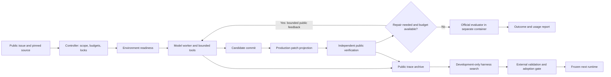

# HX: Meta-Harness Experiments for SWE-PolyBench

**An evidence-gated coding harness that studies how executable tools, verification, and bounded repair affect repository-level software engineering.**

HX wraps a coding model with a Python controller, repository tools, isolated execution, patch delivery, and recorded evaluation. The project applies ideas from [Meta-Harness](https://github.com/stanford-iris-lab/meta-harness) to [SWE-PolyBench](https://github.com/amazon-science/SWE-PolyBench), while keeping harness readiness separate from official task resolution.

**Status:** experimental research implementation. Selected tasks have official passes, but a general accuracy or cost advantage has not been established. Environment compatibility and storage remain active work. This is an independent adaptation, not the official Stanford Meta-Harness release or a reproduction of its reported results.

[Architecture](docs/ARCHITECTURE.md) · [Running the project](docs/RUNNING.md) · [Evidence and limitations](docs/PROJECT_STATUS.md) · [Meta-Harness adaptation](docs/META_HARNESS_PAPER.md) · [Contributing](CONTRIBUTING.md)

## Why this project exists

A capable model can still fail because its environment does not build, its tests inspect stale artifacts, its checks miss the requested behavior, or the patch delivered to the evaluator differs from the tested candidate. A green local check alone does not establish correctness.

HX makes those mechanisms explicit and measurable. The aim is to improve the executable system around a model, rather than repeatedly changing prompts and treating every failure as a model limitation.

The research question is:

> Can a smaller, reliable harness deliver correct patches with stronger evidence and lower observed cost, while preserving honest benchmark outcomes?

## What Meta-Harness means here

Meta-Harness searches over executable harness code around a fixed base model. The proposer uses execution experience to suggest changes; a separate evaluation process determines whether a candidate should replace the incumbent. See the [official framework](https://github.com/stanford-iris-lab/meta-harness) and [paper](https://arxiv.org/abs/2603.28052).

HX implements a bounded adaptation:

1. Preserve public execution traces and failed attempts as search experience.
2. Let a proposer inspect selected public evidence and propose a permitted code change.
3. Evaluate that change outside the proposer, using fixed checks and an incumbent comparison.
4. Retain rejected candidates and adopt only changes that satisfy the gate.
5. Freeze the chosen runtime before coding evaluation.

The implemented code-search surface initially targets failure-evidence extraction and restricted worker scaffolds. It does **not** automatically optimize every subsystem or prove that a passing compatibility gate improves solve rate. Historical configuration-only proposals are also retained. [Implementation details](docs/META_HARNESS_PAPER.md)

## Architecture at a glance



Private evaluator data is kept out of worker and proposer context. Official outcomes can be recorded even when HX's own workflow reports `needs_attention`; public readiness and official resolution are distinct outputs.

[Detailed architecture, boundaries, and state transitions](docs/ARCHITECTURE.md)

## What is implemented

| Component | Purpose |
| --- | --- |
| Python workflow engine | Owns task state, typed model contracts, bounded attempts, revisions, and exact-commit handoff. |
| Codex adapters and sessions | Execute model calls and preserve task-local context where configured. Models and reasoning settings are configuration inputs. |
| Repository tools | Provide bounded file discovery, relevance ranking, source symbols, and public-test discovery. Discovery is not passing evidence. |
| Worker scaffold | Supports restricted inspection, delegation, and finish actions without allowing candidate code to alter grading or budgets. |
| Environment preflight | Checks actual offline UID-1000 worker preparation, dependencies, writable clean source, and supported builds before model admission. |
| Source-aware build preparation | Removes stale generated outputs and rebuilds from the source under test; historical Svelte layouts have explicit recipes. |
| Production patch delivery | Projects the submitted production patch and records its identity, avoiding verification of a different source tree. |
| Public verification | Replays commands independently, captures complete bounded output, distinguishes setup failures, and checks bug reproduction where applicable. |
| Optional blind test author | Authors immutable public tests from the original issue/source before seeing a solution; lean mode omits this extra model call. |
| Official SWE-PolyBench adapter | Uses the pinned upstream evaluator separately from worker/public checks. |
| Trace and cost reporting | Records events, usage, workflow time, candidate identities, source seals, and failure classifications. |
| Bounded harness search | Proposes executable diagnostic/scaffold changes and evaluates them outside the proposer. |

The repository includes both earlier reviewed workflows and the newer lean path. The example `hx.toml` retains a Luna worker configuration; recent lean SWE-PolyBench experiments used `gpt-6.1-sol` with medium reasoning. A model choice is not evidence of comparative model quality.

## Benchmark methodology

[SWE-PolyBench](https://github.com/amazon-science/SWE-PolyBench) contains real repository issues across multiple languages. This project uses pinned inputs from its Verified subset; it does not claim full-benchmark coverage.

Recorded pins:

- Dataset: `AmazonScience/SWE-PolyBench_Verified`, revision `b3fca77b637379f0c01ad86d18753a7ac1998b53`.
- Evaluator: `amazon-science/SWE-PolyBench`, revision `9c836c5d7f3cb991934132b77d29e6941d912a07`.
- Task containers: upstream GHCR images resolved to immutable digests for each experiment.

The original comparison schedule was amended and later terminated. Later HX-only trials and compatibility repairs are separate versioned experiments, including consumed development repeats. They must not be pooled into a fresh heldout accuracy claim.

The reporting categories remain separate:

- **Environment readiness:** the runtime can prepare source, build, and exercise its runner.
- **Public verification:** independently executed public checks support the candidate.
- **Workflow readiness:** HX completed its required evidence gates.
- **Official resolution:** the submitted production patch passed upstream scoring.
- **Operational failure:** setup, execution, patch application, observation, or usage accounting prevented a valid coding conclusion.

The environment survey's synthetic one-test Mocha smoke proves runner/report plumbing only. It does not prove task behavior or official success.

## Evidence so far

| Experiment | Recorded outcome | Interpretation |
| --- | --- | --- |
| Initial paired development comparison | HX 4/10 official resolutions; Luna alone 4/10 | No demonstrated solve-rate advantage; one baseline infrastructure failure complicates comparisons. |
| Repaired lean three-task batch | MUI42412, Svelte1376, Serverless8159: 3/3 official resolutions | Small selected sample; two HX workflows still reported evidence concerns. No causal or leaderboard inference. |
| Thirty-task environment survey, first pass | 16 passed; 7 compatibility/validator flags; 7 blocked before worker checks by host storage | Readiness remains incomplete. No model coding calls or official grading. |
| Environment flag repairs | 35 Windows and 35 Linux regression checks passed; four saved smoke reports and three saved source layouts validated | Fresh container rechecks remain pending; saved-report validation is not new container execution. |

The three-task batch reported **958,903 tokens** and **710.30 workflow seconds**. Workflow seconds exclude image downloads and official grading. Reported tokens are provider usage observations, not monetary cost; turn-boundary guards can overshoot their targets.

[Evidence summary and caveats](docs/PROJECT_STATUS.md) · [Three-task report](docs/LEAN_REPAIRED_THREE.md) · [Environment survey](docs/ENVIRONMENT_THIRTY.md)

## Quick start: no model calls

Python 3.11 or newer and Git are required. Run from a checkout:

```bash
git clone https://github.com/ravenscoat/meta-harness-benchmark-SWE-PolyBench.git
cd meta-harness-benchmark-SWE-PolyBench
python -m venv .venv
```

Activate the environment:

```bash
# Linux / macOS
source .venv/bin/activate
```

```powershell
# Windows PowerShell
.\.venv\Scripts\Activate.ps1
```

Install and run the scripted demo:

```bash
python -m pip install -e ".[dev]"
python -m hx demo .hx/demo
python -m hx run .hx/demo/tasks/missing-task.json --adapter fake
```

The fake adapter checks workflow plumbing without an LLM request. It is not a coding benchmark result.

Run focused regression checks:

```bash
python -m pytest tests/test_environment_thirty.py tests/test_worker_environment.py -q
```

For real model work, configure your own Codex installation/login and model settings. [Setup, execution modes, and benchmark prerequisites](docs/RUNNING.md)

## Repository map

```text
src/hx/                Workflow engine, adapters, tools, search, API and console UI
benchmarks/polybench/  Pinned repository benchmark protocol and official-score adapter
benchmarks/             Original synthetic fixtures and research benchmark helpers
scripts/                Experiment controllers, probes, reports and preparation tools
tests/                  Regression and scripted workflow tests
docs/                   Architecture, operating guide and historical experiment reports
hx.toml                 Example local workflow configuration
```

`benchmarks/` contains original synthetic reference fixtures as well as the PolyBench adapter. Synthetic reference tests are distinct from upstream private benchmark tests. External datasets, evaluator checkouts, credentials, raw runs, and image contents are not bundled.

## Operating constraints

- Use a new recorded experiment identity for a deliberate new attempt; never overwrite a scored run.
- Complete environment gates before spending model tokens on a batch.
- Preserve immutable input, image, source, and scheduler fingerprints.
- Keep private grader content and accepted solutions out of model context.
- Do not tune a frozen runtime using reserved evaluation outcomes.
- Do not automatically restart historical campaign scripts against an existing root.
- Check host and Linux disk headroom. WSL virtual disks can retain physical growth after Docker cache deletion.
- Treat unknown usage, interrupted coding identities, and setup failures explicitly rather than hiding them as ordinary task failures.

Historical experiment scripts depend on local manifests and archives excluded from this repository. They document the research process; they are not a one-command fresh-install benchmark service. See [Running](docs/RUNNING.md) before starting model work.

## Current priorities

1. Recheck the repaired environments in real offline containers after storage headroom is restored.
2. Improve preflight coverage across version-specific build/test layouts.
3. Measure repeated context and repair costs before increasing campaign size.
4. Evaluate executable harness changes on fixed development cases and preserve separate official evaluation.
5. Improve public behavioral coverage without confusing test execution with correctness.

## Attribution

- [Meta-Harness: End-to-End Optimization of Model Harnesses](https://arxiv.org/abs/2603.28052) and [official code](https://github.com/stanford-iris-lab/meta-harness), Stanford IRIS Lab and collaborators.
- [SWE-PolyBench](https://github.com/amazon-science/SWE-PolyBench) and its upstream dataset/evaluator, Amazon Science and collaborators.
- [Codex](https://developers.openai.com/codex/) provides the model execution interface used by HX.

Upstream artifacts retain their own licenses and attribution. This repository publishes our adaptation and experiment tooling; it does not imply endorsement by upstream authors.
