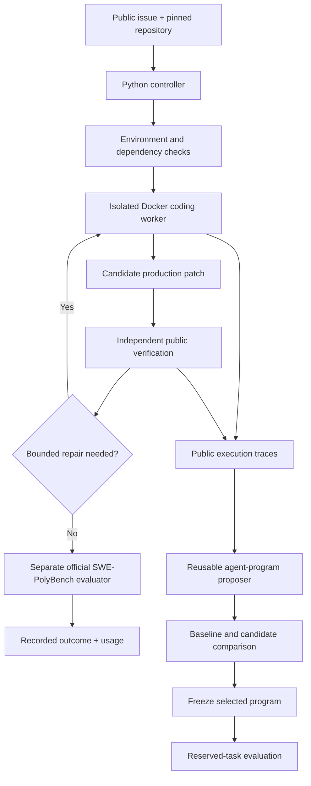

# Meta Harness for SWE-PolyBench

**A Python framework for building, evaluating and improving reusable coding-agent workflows.**

Meta Harness combines a coding model with an executable agent program: the tools,
context strategy, verification steps and repair decisions that guide how it works.
This project implements that approach for repository-level software engineering
and tests it on **SWE-PolyBench**, including tasks from **Material UI, Svelte and
Serverless**.

## Why Meta Harness matters

The model is one part of a coding agent. Its surrounding program determines
which source files it explores, how it runs tests, how it responds to feedback
and when it finishes. Improving that program creates a workflow that can be
reused across problems, rather than writing a new manual procedure for each task.

The meta layer proposes changes to executable agent programs and compares them
with a measured baseline. Development tasks provide execution experience;
separate reserved tasks evaluate a selected program. This connects agent design
to observable task outcomes, token usage and execution time.

## Architecture

| Component | Responsibility |
| --- | --- |
| Python controller | Own task state, scheduling, model settings, budgets and experiment identities. |
| Executable agent program | Choose inspection, delegation, verification and stopping actions through a restricted interface. |
| Repository context tools | Discover relevant files, symbols, callers and public tests within bounded context. |
| Docker worker environment | Run coding and checks against pinned images and clean repository snapshots. |
| Public verification and repair | Reproduce issue behavior, replay checks and apply bounded public-feedback revisions. |
| Production-patch delivery | Verify the exact production changes submitted for independent evaluation. |
| Agent-program search | Use public execution experience to propose and compare reusable workflow changes. |
| Evaluation and accounting | Record official outcomes, public checks, token usage, runtime and artifact identities separately. |

Official evaluator internals remain outside coding-worker and proposer context.
Runtime, task inputs and evaluator identities are recorded before evaluation.
Candidate selection requires measured comparison; it does not automatically
replace the installed agent program.

## Engineering improvements

- **Reusable agent-program search:** a proposer generates executable workflow
  candidates from public development traces, with paired baseline comparison
  and a separate reserved-task selection stage.
- **Compatibility-aware repair:** an experimental program recognizes excluded
  checks and unresolved compatibility findings, then requests a focused revision
  using public requirements and existing call-site behavior.
- **Exact production-patch replay:** independent checks run against the source
  delivered to the official evaluator, with task-local context across revisions.
- **Reliable worker preparation:** pinned Docker images, offline worker checks
  and source-aware builds establish the execution environment before coding.
- **Bounded image lifecycle:** one-image working sets and transport-only retry
  receipts support controlled storage and repeatable preparation.
- **Auditable execution:** source snapshots, task identities, usage and runtime
  records make agent experiments reproducible.

The compatibility-aware program is available as an
[experimental agent example](examples/agents/compatibility_guard.py).
It is an implementation artifact; a comparative solve-rate improvement has
not been established.

## Benchmark evaluation

**SWE-PolyBench** provides repository-level software-engineering tasks across
multiple programming languages. This implementation has been exercised on
selected **Material UI, Svelte and Serverless** tasks using pinned source,
containerized execution and the upstream official evaluator.

The repository includes the benchmark adapter, worker preparation, public-test
verification, patch delivery and reusable-agent comparison machinery.

The baseline coding workflow completed two officially resolved Serverless3457
trials with public verification. These demonstrate end-to-end execution on
selected tasks; they are separate from evaluating a newly proposed agent program.

[Architecture](docs/ARCHITECTURE.md) · [Benchmark integration](docs/BENCHMARK.md)

## Research foundation

Inspired by [Meta-Harness](https://github.com/stanford-iris-lab/meta-harness),
which searches over executable programs surrounding a fixed base model.
Benchmark integration uses [SWE-PolyBench](https://github.com/amazon-science/SWE-PolyBench).
This repository is an independent implementation of those ideas.
