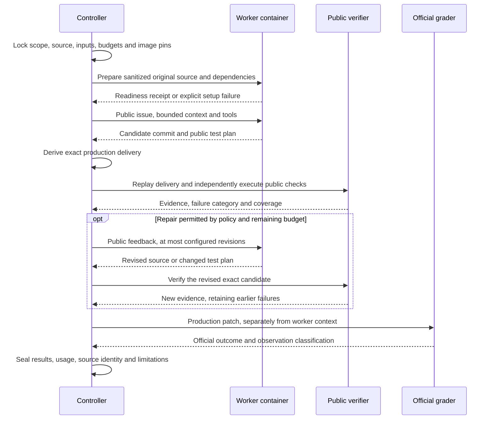
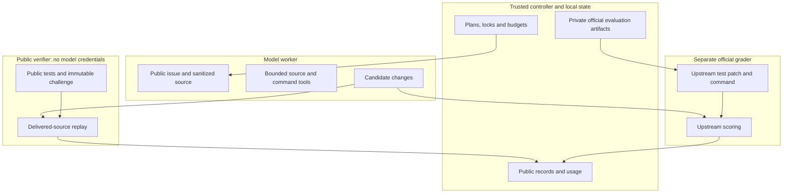

# Architecture

HX separates model execution, public evidence, patch delivery, and official scoring. Python owns the workflow; a model produces candidate changes within a recorded task and budget. Experimental meta-search operates outside a frozen coding campaign.

## Component map

| Layer | Implementation | Responsibility |
| --- | --- | --- |
| Task/configuration | `src/hx/config.py`, `models.py`, `hx.toml` | Typed task inputs, settings, contracts and configuration identity. |
| Workflow | `src/hx/engine.py`, `single_workflow.py` | Implementation, verification, bounded revision, handoff and exact-commit decisions. |
| Model transport | `src/hx/adapters.py`, `benchmarks/polybench/containers.py`, `sessions.py` | Codex calls, container execution, session continuation and usage capture. |
| Repository context | `src/hx/repo_context.py`, `benchmarks/polybench/repo_context.py` | Bounded source discovery and public-test navigation. |
| Executable scaffold | `src/hx/worker_scaffold.py` | Restricted inspection/delegation/finish policy around worker calls. |
| State | `src/hx/store.py`, `benchmarks/polybench/state.py` | Persisted events, run state, immutable exported monitoring snapshots. |
| Environment | `worker_environment.py`, `dependencies.py`, `image_cache.py` | Source-aware builds, public preparation, immutable images and bounded retention. |
| Public verification | `public_checks.py`, `regression.py`, `contract_coverage.py`, `report_capture.py` | Command admission, independently captured evidence, base reproduction and coverage binding. |
| Independent author | `benchmarks/polybench/independent.py` | Optional immutable tests from original public inputs, isolated from the candidate. |
| Delivery | `benchmarks/polybench/delivery.py`, `delivery_parity.py` | Projection/replay of the production patch that is sent to grading. |
| Official grading | `benchmarks/polybench/grader.py` | Pinned upstream scorer in a separate fresh container. |
| Meta-search | `src/hx/code_search.py`, `scripts/run_code_search.py`, `worker_scaffold_search.py` | Permitted executable proposals, external evaluation, archive and gated adoption. |
| Monitoring | `scripts/hx_console.py`, `src/hx/web/` | Recorded progress, evidence, models, costs and results. |

PolyBench filenames in the table are relative to `benchmarks/polybench/` unless otherwise specified. Historical campaign controllers live in `scripts/`; their manifests are local experiment artifacts.

## Coding execution

Lean PolyBench trials use one implementer and optional task-local session continuation for repair. Earlier reviewed modes and optional separate test-author contexts remain available. Those are separate execution modes, not extra mandatory roles in every run.

## Source and delivery identity

Sanitized input snapshots preserve the upstream source tree while removing private evaluation material and unrelated history. Gitlinks are handled as immutable baseline entries; source/path checks reject unsafe transfers.

A candidate's whole working tree is not automatically the official submission. The delivery layer derives the production patch, records its hashes, and reconstructs the submitted source for independent replay. Verification must apply to that delivered production tree. Implementer test edits cannot silently change the independent challenge.

For a genuine test-plan-only revision, the source commit and patch identity stay unchanged while an altered plan is independently executed. Empty initial implementations and unchanged no-op revisions remain invalid. A plan revision is workflow evidence, not task resolution.

## Build freshness and test evidence

Generated artifacts are cleared before a supported build. The build executes as UID 1000 using the source being checked. Output ownership is limited to declared ignored/untracked generated paths; tracked source and symlink protections remain in place.

Svelte's version-specific recipes recognize concrete public build layouts rather than accepting arbitrary scripts. Optional runtime output paths are prepared only when their corresponding source entry exists. Unsupported layouts fail explicitly and require a recorded repair.

Verification captures full combined output up to a configured bound. Truncation, setup errors, timeouts and unrecognized reports cannot be relabeled as passing tests. The survey's installed-Mocha smoke checks one known synthetic test; it does not measure repository correctness.

Public bug checks can require a behavioral failure on the original base followed by successful candidate execution. Coverage bindings must refer to actually observed public tests. Neither model-authored tests nor static bindings guarantee complete issue coverage.

## Trust boundaries

Worker containers do not receive the dataset, private grader files, host home or Docker socket. Model authentication is staged only where a model transport needs it and cleaned up; public verifier containers run without it. Restricted repository navigation mounts only its tool file, not the directory containing evaluator code.

Container capabilities and privilege controls reduce exposure, but this is not a hardened hostile-code sandbox. Some model containers relax seccomp for nested sandbox compatibility. Review the implementation before running untrusted workloads.

## Persistence and supervision

Native Linux workspaces and SQLite state avoid cross-filesystem locking problems. Windows monitoring consumes uniquely named immutable JSON snapshots instead of opening a Linux writer's database across filesystems.

Experiment roots retain configuration, source/image/input seals, events, public commands, candidates, scores and usage. A controller lock prevents duplicate scheduling. Interrupted identities and unknown usage are operational states; they cannot be replaced with a clean-looking rerun.

Token/deadline checks occur at boundaries. A single model turn can overshoot a target, so reported costs are observations rather than exact in-flight caps. Workflow time does not include every download or official grading stage.

## Development-only meta-search

The outer loop follows a bounded propose/evaluate/archive/adopt sequence. The proposer can inspect selected public development experience and edit only an allowed executable surface. Evaluation is a separate credential-free process with its own tests and limits. Accepted code must satisfy the incumbent comparison and regression gates.

A diagnostic extraction win measures evidence retention and excerpt size. It does not measure end-to-end coding accuracy, model-token savings or monetary savings. Whole-harness autonomous optimization remains an ambition, not a demonstrated capability.

Freeze executable code before reserved evaluation. Do not feed private grader contents or accepted solutions into model context, or tune a frozen runtime using reserved outcomes.

## Current limits

- Build/test compatibility is version-specific; preflight does not cover every upstream task.
- Public tests can pass while an official behavioral test fails.
- Same-model author/implementer contexts can make correlated mistakes.
- WSL physical disk growth can persist after cache deletion; host storage must be checked separately.
- Historical runners contain campaign-specific manifests and paths; fresh setup requires deliberate preparation.
- Selected passes and consumed-task repeats do not establish a general harness advantage.

See [Running](RUNNING.md), [Project status](PROJECT_STATUS.md), [historical architecture notes](ARCHITECTURE_HISTORY.md), and [the Meta-Harness adaptation](META_HARNESS_PAPER.md).
