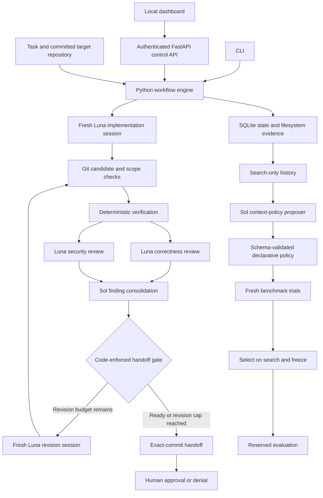

# HX architecture and implementation status

The [image lifecycle repair](IMAGE_LIFECYCLE_REPAIR.md) is now validated with
all3 pinned images retained across repeated stages and actual offline worker
checks passing. Exact Svelte2 compiler/SSR/shared/store build recipe@4 closes
the discovered old-layout preparation gap.40checks per platform passed.
Versioned failure/success evidence and original batch/results remain intact;
no model execution or coding accuracy claim from these mechanism checks.

[Batch image lifecycle@2](IMAGE_LIFECYCLE_REPAIR.md) adds a sealed bounded
retention input for all three selected images across preparation and coding.
Digest reacquisition consumes and saves registry error streams, then checks the
pinned image identity before use. Default sequential caches and storage guards
remain; there is no mutable-tag fallback. Actual environment validation pending.

The [worker/parser repair](WORKER_PARSER_REPAIR.md) adds an exact Svelte3
Rollup/TypeScript preparation recipe and requires actual offline worker readiness
before all-task coding admission. Public requirement inventory@3 strips hidden
HTML instructions and block delimiters while retaining visible requirements.
Validated with real UID1000 source-build freshness and bounded public tests; no new
official task outcome claimed. Old results and frozen snapshots remain preserved.

Completed [three-task lean evaluation](LEAN_THREE.md):2official resolutions,
1worker build setup failure before model/grader execution. The reference-image
gate does not guarantee compatibility with HX's separate worker build recipes;
actual worker preparation must be checked before batch admission. MUI public
requirement parsing also retained HTML/template fragments, producing needs_attention
despite an official pass. Frozen results preserved; no live repair or causal gain
claim. Feature tasks currently omit automatic bug-only base/coverage gates.

New opt-in [lean task runtime](LEAN_HARNESS.md) provides task-scoped native Codex
history across repair, explicit usage breakdown, optional blind authoring via
engine selection, and exact production replay excluding existing test edits.
The native two-call transport smoke passed. One consumed MUI36353 repeat officially
passed with275555 reported tokens and341.84 workflow seconds, lower observed costs
than its earlier attempt; general cost/accuracy improvement is not established.
Workflow evidence gaps remain blocking. Explicit new-test-file replay guidance was
added after that trial and tested without another model run. Historical
independent-author runtimes and the exact scored lean snapshot stay archived.

[Svelte readiness evidence](SVELTE477_READINESS.md) now exercises the reconstructed
production tree with a broader public contract suite and a source mutation
control. Build/report failure handling was checked on Linux and Windows. These
are verification mechanism checks; the saved official failure remains unresolved.

Current independent verification is `blind-public-challenge@4`: original base,
exact delivered production patch, then frozen challenge. It excludes implementer
test/fixture edits, rejects challenge collisions and records projection hashes.
See [independent delivery repair](INDEPENDENT_DELIVERY_REPAIR.md). The earlier
Svelte-only parity gate below is superseded; original tests may encode obsolete
feature expectations. Official correctness remains a separate result.

Historical v13 design (no longer an active blocking stage):

New public verification stage: [production delivery parity](DELIVERY_PARITY_REPAIR.md)
replays the exact projected source tree against original public tests/manifests.
The independent Svelte workflow invokes it when existing test files changed;
green full-candidate checks alone cannot pass the combined gate after a delivery
mismatch. Other repositories are outside the initial validated scope. Original
expectation conflicts are reported without inferring official failure causes.

Latest official Svelte477 outcome: [completed attempt](SVELTE477_DIRECTORY_BENCHMARK.md)
passed HX public verification and immutable challenge replay but failed official
behavioral grading. Reproduction now reached implementation and grading; no
patch/infrastructure/missing-test issue was recorded. The current evidence
shows public-check insufficiency for this candidate, not official resolution.

Public reproduction @9 now uses the shared test-path convention for actual
Mocha test-body frames, supporting directory-based tests as well as suffixes.
[Directory path repair](DIRECTORY_TEST_CLASSIFIER_REPAIR.md) independently replayed
both sealed public plans offline. Generated-constructor/count/message checks and
setup rejection remain required; all113historical scores remain unchanged.

Latest Svelte classifier attempt: [completion audit](SVELTE477_CLASSIFIER_BENCHMARK.md)
found a directory-test path gap. Generated-constructor recognition requires
suffix-named tests, while the independent author used `test/.../index.js`.
Implementation and official grading did not run. Frozen runtime and all112
historical scores were verified unchanged; this result does not invalidate the
earlier suffix-path mechanism replay, but demonstrates its insufficient breadth.

Public reproduction update: [generated runtime exceptions](RUNTIME_EXCEPTION_CLASSIFIER_REPAIR.md)
are recognized under a narrow structured Mocha rule: complete consistent counts,
matching error message, generated-constructor throw frame and actual test-body
frame. Setup/hooks and unknown exceptions remain rejected. The exact original
Svelte477 public replay now establishes reproduction, preserving all112 previous
scores. Official resolution remains a separate measurement.

Environment update: [Svelte477 legacy Rollup layout](SVELTE477_ENVIRONMENT_REPAIR.md)
is supported by an exact manifest/config recipe shared across worker and public
verification paths. The actual pinned offline image passes59public parser tests
and rebuilds a controlled source change. Original parallel scores remain sealed;
this repair does not replace the failed Svelte identity or establish official
resolution.

Latest concurrency evidence: [three-question batch](PARALLEL_THREE.md) completed
with two official resolutions and two successful HX workflows. Both MUI model
runs overlapped; Svelte477 stopped before a model call due to unsupported build
layout. MUI36353 corrected duplicate coverage evidence through the exact-source
plan-only revision path. The frozen runtime and all106prior score hashes remained
unchanged. This supports two-task concurrent execution on the observed cases;
it does not establish universal batch reliability or three-way model concurrency.

Latest task result: [MUI18141](REMAINING_QUOTA_BENCHMARK.md) passed the pinned
official scorer with all required tests observed and no grader/patch errors.
Immutable independent public candidate replay passed. HX still marks the handoff
`needs_attention` for duplicate contract-coverage evidence and insufficient repair
headroom; official resolution and workflow acceptance remain separate. All prior
104 score hashes are preserved. This is one consumed development success.

Current repair: [file-backed public report capture](REPORT_CAPTURE_REPAIR.md)
is shared by base reproduction and candidate verification for explicit JSON
reporter commands. Three actual offline replays now produce complete behavioral
reports, including the previously truncated plan. 102 checks passed; 104 old
scores are preserved. This fixes the capture mechanism, not an official task.

Latest result: [complete-log ingestion](REPORT_INGESTION_REPAIR.md) works on
both saved offline replay plans, but the new author-produced6.13MB report was
truncated JSON. The task stopped before implementation. No official solution
was graded; frozen runtime and failed identity remain preserved.

Latest consumed MUI attempt: [public replay log ingestion](LABEL_CLASSIFIER_REPAIR.md)
discarded a complete 4.67MB behavioral test report at its 2MB cutoff. The repaired
classifier recognizes the raw report, but the live gate only saw stderr. No
implementation or official candidate grading followed. The scored failure is
preserved; runtime stays frozen and the completed controller is stopped.

Latest task evidence: [MUI 18141](WORKER_LOOP_BENCHMARK.md) demonstrated scaffold
inspection/delegation, but stopped before implementation because the public
base classifier rejected label-query behavioral errors. No official candidate
was graded. The frozen failed identity is preserved; no repair or rerun is made.

Latest addition: [executable worker-loop search](WORKER_LOOP_SEARCH.md), an opt-in
`next_action(state)` policy around trusted worker calls and public inspection.
Candidates cannot bypass schemas, budgets, independent tests or official grading.
The recovered Sol candidate is experimental; fixture/regression execution does
not establish model coding improvement. Existing frozen evaluations stay stopped.

Latest development version: [official-code adaptation](META_HARNESS_OFFICIAL_ADAPTATION.md),
runtime @12 with a shared public runner contract and early challenge-command
validation. Actual offline MUI base reproduction succeeded; two Serverless
container checks remain blocked by absent cached images. No coding win is claimed.
Runtime @11 and its three failed attempts remain archived. This repair does not
extend code search by itself; the new scaffold extends the outer worker loop,
while Codex CLI's internal tool loop remains unchanged.

Current frozen protocol: [independent challenge verification](INDEPENDENT_THREE.md),
runtime @11. A fresh test-author call sees original public source before a fix;
HX requires base reproduction, freezes its tests, and replays them separately on
the candidate. Failed independent checks block readiness and enter bounded
repair. The three-task evaluation completed with three harness command validation
failures before implementation: Node-invoked Mocha/cross-env entrypoints were
unsupported by the replay allowlist. No official candidate was graded. Frozen
runtime and scores are preserved; no coding improvement is demonstrated.

Completed repair diagnostic: [two completed failures](TWO_FAILURE_REPAIR.md),
2/2 reference-guided official resolutions, zero model calls, unchanged official
scoring, all required observations and no grader/patch errors. These are not
autonomous harness wins. Runtime @10 adds conservative Testing Library assertion classification.
The stopped five-task batch remains stopped; old scores and snapshots are retained.

Active experiment: [five failed-task retries](FIVE_FAILURE_DEVELOPMENT.md),
one Sol worker per task, no reviewers or baseline arms, at most one repair,
under frozen runtime @9. Original official outcomes remain sealed; new official
scores and workflow verification will be reported separately. Results pending.

Current runtime: [Svelte classifier repair](SVELTE_CLASSIFIER_REPAIR.md),
`polybench-public-tests@9`, attests the public runner before accepting known
same-sample follow-up errors after assertions. Model-free fresh-container
verification of the unchanged Svelte 728 candidate now passes and records a
ready_for_approval recovery handoff. The original official success and version-8
needs_attention record are retained without score rewriting.

Latest runtime: [worker environment repair](WORKER_ENVIRONMENT_REPAIR.md),
`polybench-public-tests@8`, adds a validated public Svelte build prerequisite
under the actual worker UID, refreshes generated outputs before candidate/base
replay, caps model execution by the global workflow deadline, and preserves
unaccepted interruption drafts. It passed a real offline build and 29 focused
baseline tests. The renewed consumed-task development attempt in
`.hx/worker-environment-development-v2` officially solved Svelte 728, with all
required tests observed and no patch/grader error. Independent candidate replay
passed 60 public tests, but workflow readiness remains false: the original-source
classifier rejected a mixed assertion/follow-up-skip report, and repair token
headroom was exhausted. This is one consumed-task development result, not a
general solve-rate or causal improvement claim.

Latest development: [public contract coverage](CONTRACT_COVERAGE.md) adds a fixed
public issue inventory, worker-supplied test mappings, independent named-test
observation, and a blocking verification check in `polybench-public-tests@7`.
Candidate metadata is durable and evidence-only repairs preserve the exact source
commit. This adds no model call and does not replace independent official scoring.

The latest [delivery/public-test repair](HARNESS_REPAIR_REPORT.md) separates
full candidate regression evidence from benchmark production patch delivery,
normalizes supported test environment assignments, disables Babel cache writes,
records Mocha lifecycle adaptation, and captures the actual worker tool inventory.
Historical results below retain their original scores; diagnostic recoveries
are separate experiments.

Current development uses [one Luna worker](SINGLE_LUNA.md) with a separate
[Sol meta loop](HX_META_LOOP.md). Sol's consistent runtime configuration was
automatically adopted after regression and fixture gates. The working runtime
also preserves completed candidates at token boundaries, recovers completed local
CLI results after shutdown timeout, and prioritizes failure diagnostics. The
new live smoke failed at shutdown; its separately recorded model-free candidate
replay passed. Historical benchmark scores below retain their original meaning.

Latest update, **3 October 2026 (Asia/Karachi)**: the public PolyBench comparison
was ended by the user at 27/51 scored trials. Its evidence and frozen runtime
snapshots are preserved. Development now uses an HX-only improvement batch with
independently replayed public tests and no model call for empty consolidation.
See [the improvement loop](HX_IMPROVEMENT_LOOP.md). The older completed campaigns
described below are separate experiments.

Overnight version 3 adds exact-commit test-plan-only revisions, clearer functional
test contracts, read-only quota guards, shared usage accounting and a locked
HX-only staged runner. Its three development attempts finished with two official
resolutions and two ready workflows; these are selected development evidence.
The final runtime was frozen for HX-only reserved evaluation. All six reserved
attempts are complete: **1/6 officially resolved**, **0/6 end-to-end task success**,
two patch rejections, two observed official test failures and one attempt without
an accepted candidate. There were no grader infrastructure errors. The React MUI
patch officially passed but its HX workflow exhausted the revision token budget.
No task-level improvement or leaderboard result is established. The runtime adds optional
bounded repository navigation through a single-file read-only worker mount,
conventional test:<suffix>/test-<suffix> script support, and evidence-based
correctness blocking independent of severity. Final checks passed 95 Linux tests,
then seven tool/compatibility checks and a real Python 3.7 worker-container probe.
There was no remaining development model slot for the final additions.
See [overnight work](OVERNIGHT_WORK.md) for scope and [the improvement loop](HX_IMPROVEMENT_LOOP.md)
for measured development evidence.
See [the morning report](MORNING_REPORT.md) for current results and limitations.
The final audit preserves all scores and verifies the source freeze. Recorded
overnight usage is **5,309,568/6,000,000 tokens**. No further trial is scheduled.

Status snapshot: **2 October 2026, Asia/Karachi**. Workspace: `D:\projects\Harness`.
This document describes the code and saved evidence currently present in this checkout.
Both final evaluation campaigns are complete: **100 model trials**. Neither campaign demonstrated a reserved success gain. See [final benchmark results](BENCHMARK_RESULTS.md).

## 1. Purpose and current state

HX is a local coding harness for bounded bug fixes and small features in committed
FastAPI applications, with React support for targets using the supplied frontend
layout. GPT-6 Luna implements and reviews changes. GPT-6.1 Sol consolidates review
findings and proposes context policies during benchmark search. Python controls
execution, verification, evidence, budgets and approval.

Two layers are implemented:

- **Coding harness:** task intake, isolated implementation, deterministic checks,
  independent reviews, bounded revisions and an exact-commit human decision.
- **Meta-harness:** saved search history, Sol policy proposals, fresh evaluations,
  search-based selection and reserved evaluation before policy adoption.

The optimizer currently changes instructions and supplied context. It does not
rewrite executable harness code, train models or change their weights.

| Area | Current evidence |
|---|---|
| Harness automated tests | Last full run: **73 passed**, one dependency deprecation warning |
| Static checks | Repository Ruff checks passed |
| React sample | Sample test and production build passed; manual browser save/refresh smoke check passed |
| Real coding workflow | A prior Luna/Sol demo reached `ready_for_approval`; approval remained pending |
| Repair campaign | Complete: 72 trials; one-shot and standard HX both 8/12 on reserved tasks |
| Audited feature campaign | Complete: 28 trials; all three arms scored 2/4 on reserved tasks |
| Reserved evaluation | Both complete; feature selection frozen to tuned-2 before reserved trials |
| Policy promotion | No tuning improvement demonstrated or policy promoted |
| Fresh comparison | 24/24 complete: one-shot 7/8, archived HX 8/8, improved HX 8/8; no updated-runtime success gain |

The initial 100 trials and separate 24-trial fresh comparison are complete. No candidate was approved,
merged, pushed or deployed during implementation. Service URLs below describe
configured endpoints, not a guarantee that the corresponding process is running.

## 2. System overview



The workflow engine is deterministic orchestration code. Models produce proposed
code changes, findings or policy JSON. They do not decide whether their own claims
constitute valid evidence, whether a budget can increase or whether approval is allowed.

The **control application** and the **target application** are separate. The HX
dashboard controls runs; the React sample represents an application the workers modify.

## 3. Roles, tools and permissions

| Role | Model | Inputs | Access and output |
|---|---|---|---|
| Implementer | `gpt-6-luna` | Task, constraints, target clone, executable/test context; optional policy context | Codex CLI terminal and file editing in `workspace-write`; structured summary |
| Revision worker | `gpt-6-luna` | Previous candidate plus verification, reviews and consolidation | Fresh writable clone; revised code and structured summary |
| Correctness reviewer | `gpt-6-luna` | Frozen candidate, actual diff and verification report | `read-only`; findings and inspection gaps |
| Security reviewer | `gpt-6-luna` | Same frozen candidate with a separate role prompt | `read-only`; findings and inspection gaps |
| Consolidator | `gpt-6.1-sol` | Both reviews, source findings, verification and candidate hash | `read-only`, initially empty Git repository; grouped findings |
| Optimizer | `gpt-6.1-sol` | Search scores and browsable search-history files | `read-only`; declarative policy and testable hypothesis |

Each invocation uses `codex exec` with fresh ephemeral sessions, JSON events and a
required output schema. The adapter ignores user CLI configuration, disables web
search, requests shell network access off and uses `approval_policy=never`.
On Windows it explicitly selects the configured native sandbox backend.

Workers use preinstalled Python and frontend dependencies. They are instructed not
to install packages, create commits, change Git configuration or publish anything.
Allowed/protected paths are checked against the actual candidate after execution;
these path rules are not individual OS write-denial rules.

Python installs frontend dependencies offline from a prepared npm cache with
`npm ci --offline --ignore-scripts`. This setup is outside the model's authority.
No browser automation or external connector integration has been added to the
worker configuration. The operator's browser smoke check is separate from worker tools.

## 4. Coding workflow and evidence gates

1. **Intake.** Validate a strict task specification and resolve its base revision
   to a committed Git snapshot. Uncommitted working-copy edits are excluded.
2. **Implement.** Start a fresh clone and a fresh Luna session. Capture the actual
   changes independently of the model's summary.
3. **Seal candidate.** Check permitted paths and protected files, reject unsupported
   symlinks/submodules, and derive the candidate commit and diff digest using Git.
4. **Verify.** Run the appropriate deterministic verifier in a separate clone with
   workspace-specific database and temporary paths.
5. **Review.** Run correctness and security reviewers in parallel against the exact
   same frozen candidate. Seal a successful branch even if its sibling fails.
6. **Consolidate.** Sol groups findings. Every source finding must appear exactly
   once; consolidation cannot downgrade a source blocker or high/critical severity.
7. **Revise or hand off.** If checks fail, blockers remain or reviewers could not
   inspect required evidence, request a bounded revision when available. Verify and
   review every revision. At the cap, hand off the final assessed candidate.
8. **Decide.** A human approves or denies the full candidate hash. The runtime
   revalidates sealed evidence and candidate freshness before recording the decision.

Run states include `pending`, `running`, `failed`, `cancelled`, `ready_for_approval`,
`needs_attention`, `approved` and `denied`. One-shot benchmark runs also use
`baseline_complete`.

`verified` means configured checks passed. `reviewed` means both reports cover the
candidate; it does not mean they found no problems. Readiness requires passing
verification, no source blockers/high-critical findings and no reviewer
`could_not_inspect` gaps. General `known_gaps`, such as missing independent
acceptance, are reported but do not themselves block readiness.

Approval records a decision. It does not merge, push, deploy or modify the original
target repository. `needs_attention` cannot be approved through the normal gate.

## 5. Verification paths

| Path | Checks | Important limits |
|---|---|---|
| Backend-only standard task | Changed Python syntax, app import, pytest with backend coverage, changed-line coverage, optional built-in demo acceptance | Independent acceptance is built in only for the five demo cases; coverage is not proof of behavior |
| `frontend: true` task | Backend pytest, React Vitest with one worker, Vite production build | Current full-stack verifier uses `tests` and `frontend` layout; no changed-line coverage or separate app-import gate |
| Repair benchmark acceptance | Fresh evaluation clone; private API/concurrency programs and React hook tests | Runs after the coding workflow; only group scores enter optimizer history |
| Advanced feature verifier | Full-stack visible checks with timeout recovery | Bounded visible-test timeout becomes a failed check that can reach review/revision |
| Advanced feature acceptance | Private sync/replay and React outbox checks with bounded failure handling | Acceptance timeout becomes a failed score; cancellation, integrity and other unexpected failures still propagate |

The frozen repair campaign retains its original verifier: a visible-test timeout
can abort the workflow rather than become revision feedback. The recovery verifier
is implemented in the advanced extension and is also used by the policy runner.
It has not replaced the frozen repair campaign's behavior.

Benchmark **task success** requires both independent acceptance and visible
verification. Approval readiness is a separate outcome: a `needs_attention` candidate
can pass benchmark checks, and a `ready_for_approval` candidate can fail later private
acceptance. Private benchmark acceptance is not automatically added to the human
approval gate. Failed runs without a verified handoff/baseline do not count as solved.

## 6. Context and persistent memory

Worker context is assembled explicitly from role instructions, task requirements,
allowed/protected paths, executable information and stage-specific evidence.
Workers can inspect repository files with filesystem tools. A revision receives
the previous code and relevant feedback, not the previous session's full conversation.

Policies can additionally supply:

- Reusable implementer guidance, up to 10,000 characters.
- An environment snapshot: tracked files, executable and backend/frontend setup.
- Selected initial source from `backend/app.py`, `frontend/src/hooks.jsx` and
  `README.md`, capped at 25,000 characters per file.

There are two persistent stores:

| Store | Contents | Use |
|---|---|---|
| SQLite state | Runs, steps, ordered events, cache keys and artifact hashes | Execution authority, recovery and integrity checks |
| Filesystem evidence | Prompts, schemas, JSON results, stdout/stderr, patches, clones, reports and scores | Inspection, audit and optimizer retrieval |

Sol browses copied search history selectively rather than receiving every trace
in its initial prompt. Private evaluator programs/diagnostics and reserved-task
results are excluded from that copied history. The advanced warm-start preparation
copied 48 completed repair search trials, including both proposed policies; provisional feature pilots were
not included.

No vector database, automatic cross-task lesson retrieval for Luna, custom context
compaction, fine-tuning or persistent model-session memory is implemented. Lessons
carry forward through saved evidence and explicitly supplied policies.

## 7. Recovery, budgets and integrity

Each retry starts from its declared input commit in a fresh clone. Failed partial
changes remain in the failed attempt directory for diagnosis. Sealed completed
steps can be reused only when inputs, configuration, prompts, runtime code and
candidate evidence still match. Resume restarts a failed step; it does not resume
inside a model session. Startup errors are not automatically retried.

Per-run OS file locks prevent concurrent CLI/API execution or decisions on one run.
Artifact hashes are stored in SQLite and checked when evidence is reused. Atomic
file replacement protects artifact writes; SQLite owns event ordering.

| Setting | Normal `hx.toml` / defaults | Repair profile | Advanced feature profile |
|---|---:|---:|---:|
| Revisions | 2 | 1 | 1 |
| Attempts per retry batch | 2 | 1 | 1 |
| Maximum explicit resumes | 3 | 2 | 2 |
| Worker attempt timeout | 600 s | 240 s | 360 s |
| Verification command timeout | 90 s | 90 s | 90 s |
| Run wall-time ceiling | 3,600 s | 900 s | 1,200 s |
| Observed token ceiling | 400,000 | 600,000 | 800,000 |
| Command log limit | 20,000,000 bytes | 20,000,000 bytes | 20,000,000 bytes |

Windows uses kill-on-close Job Objects; POSIX uses process groups for ordinary
child-process cleanup. Token usage arrives at model turn boundaries, so a limit
can be overshot by a turn. Cached input is a subset of reported input and is not
counted twice. A killed model process may report no usage; zero recorded tokens
on a timeout does not mean zero actual cost. There is no hard dollar cap.

## 8. Meta-harness and benchmark protocol

The repair collection contains 12 original cases, split into six search and six
reserved tasks. They cover idempotent creation, tenant isolation, atomic version
checks, keyset pagination, transactional archive, PATCH semantics, search races,
optimistic updates and editor-session ownership. Combined cases cover multiple subsystems.

The audited feature collection contains four original missing-feature tasks:
`delta-api`, `durable-outbox`, `fullstack-sync` and `sync-recovery`. Search evaluates
API and queue implementation separately; reserved tasks combine them. Contracts
cover durable replay, concurrent writes, offline persistence, acknowledgement
validation, retry, version rebasing, tenant changes, unmount and React StrictMode.

For each collection, the campaign:

1. Runs one-shot Luna on search tasks: implementation plus visible verification.
2. Runs standard HX on the same search tasks: verification, reviews, consolidation
   and bounded revision.
3. Asks Sol for a schema-validated policy, then runs fresh full-workflow search
   trials. Repeats for the configured proposal count.
4. Selects the full-workflow arm with most search successes, breaking ties by
   lower observed tokens, and freezes the selection.
5. Evaluates one-shot, standard HX and a distinct selected tuned policy on reserved
   tasks. Reserved feedback never returns to the proposer.

Policies cannot change models, budgets, tests, evaluator code, allowed paths or
approval gates. This is constrained context-policy optimization inspired by
[Meta-Harness](https://arxiv.org/pdf/2603.28052), rather than unrestricted executable
harness evolution. The timeout-recovery extension was written by the operator;
it is not a Sol-generated executable policy.

The policy runner requires a completed campaign, matching paired reserved trials
and a reserved success gain over standard HX before normal adoption. An explicit
`--experimental` option permits further evaluation without such a gain, while
retaining evidence and human decision gates.

Normal adoption also rejects quota-interrupted reserved comparisons. Measured
policy targets are read from the authoritative run configurations in SQLite,
checked against their fingerprints and retained during adoption. In the repair
campaign context policies reach implementers. The audited feature extension also
supplies policy guidance and optional current candidate source/environment to the
read-only correctness and security reviewers. The operator added this capability
before freezing that extension; Sol selects its context rather than changing code.

`scripts/run_campaign.py` retains controller logs and stops scheduling after a
scored provider-quota failure. A `stop-after-case` file requests a pause at the
next scored case boundary. Remove it and repeat the command to resume using
sealed scores and the original campaign clock. The supervisor does not change
worker budgets, scores or policy selection.

### Recorded results and unfinished evaluation

| Repair search arm | Passed / logged trials | Rate |
|---|---:|---:|
| One-shot Luna | 8/12 | 66.7% |
| Standard HX | 9/12 | 75.0% |
| First Sol-tuned policy | 8/12 | 66.7% |
| Second Sol-tuned policy | 8/12 | 66.7% |

Two first-policy trials were affected by the usage-limit interruption. These are
recorded operational outcomes, not a clean comparison of model capability. Both
proposals completed. Standard HX won the search comparison and its selection
was frozen before reserved evaluation. Neither tuned policy improved search success.

Repair reserved evaluation is complete. Both one-shot and standard HX solved
8/12 trials: all eight passes and all four failures match across paired trials.
The descriptive difference is 0 percentage points. Standard HX reached approval
readiness in eight trials, and private acceptance passed in ten, but two of those
acceptance-passing trials failed visible verification. No reserved repair trial
was quota-interrupted. See `.hx/experiments-v1/ANALYSIS.md` for all outcomes.

The final campaigns completed **72 repair trials and 28 feature trials: 100 total**.
These model trials are separate from the 60 automated tests of the harness itself.

Feature search finished with one-shot 3/4 and standard HX, tuned-1 and tuned-2
each 4/4. Standard HX used 1,553,290 observed tokens, tuned-1 2,037,132 and
tuned-2 1,348,238. Tuned-2 won the preset token tie-breaker and its selection was
frozen before reserved feature evaluation. Both proposals together used 931,554
additional observed tokens. Search efficiency does not establish net savings
after optimization cost.

Feature reserved evaluation finished at **2/4 for one-shot, standard HX and tuned-2**.
Each paired comparison gained one success and lost one success, for zero net gain.
The normal policy adoption guard therefore refuses promotion. See
[final benchmark results](BENCHMARK_RESULTS.md) for costs and interpretation.

During reserved evaluation, the operator found that the frozen private queue
evaluator's storage substitute omitted the standard `removeItem` method. The
frozen model runs, original scores and selection are retained. A separate
compatible-method evaluator in `.hx/sync-storage-audit-v8` was validated against
three queue references and three seeded failures, then applied to the same
candidate commits. **All 20 queue candidate outcomes match the original scores**,
and tuned-2 remains the search winner. The completed hash-verified audit clears
the evaluator-audit gate; normal adoption still fails the reserved-improvement
requirement. Changed outcomes would require a clean follow-up.
This post-selection evaluator correction is reported explicitly, not hidden.

Two provisional feature pilots were retained and excluded after auditing found
missing wire-schema/error semantics and overstrict response-shape assertions.
The corrected collection is `.hx/sync-features-v7/manifest.json`; all four seeded
failures and reference solutions were validated. The final experiment directory
is `.hx/sync-experiments-v4`, with its frozen source archive in `runtime-source-v7`.

Completed score files are reused when their identities match, including recorded
failed trials. Restarting a campaign does not silently rerun or repair quota-affected
scores. Additional reruns require explicit experimental accounting. The original
campaign wall-time clock also persists across interruption.

### Interpretation limits

- These are original synthetic tasks, not SWE-bench or Terminal-Bench scores.
- Tasks share one application family; reserved results do not establish transfer
  to unrelated repositories. Two repeats are descriptive, not strong statistical evidence.
- References and tests are AI-authored and mechanically validated, without
  independent human ground-truth review.
- Arms share per-task resource ceilings, but reviewers and revisions consume
  additional realized compute. Observed tokens are not dollar-cost measurements.
- Provisional feature execution overlapped repair tuning on one host/service;
  concurrency provenance is retained. Wall times are not isolated efficiency measurements.
- Acceptance tests exercise APIs and React hooks, not automated browser end-to-end
  behavior. Frozen repair inputs retain earlier illustrative UI wiring; subsequent
  template wiring corrections are outside those trial scores.

## 9. Components and repository map

| Path | Responsibility |
|---|---|
| `src/hx/models.py` | Strict task, settings, candidate, verification, review and handoff contracts |
| `src/hx/cli.py` | Task operations, serving, demo, validation and optimization commands |
| `src/hx/engine.py` | Scheduling, step reuse, parallel reviews, revisions and exact-commit decisions |
| `src/hx/adapters.py` | Real Codex execution and scripted fixture adapter |
| `src/hx/git.py` | Clone, candidate derivation, diff and scope/integrity checks |
| `src/hx/store.py` | SQLite authority, events, artifact metadata and atomic writes |
| `src/hx/config.py` | Configuration, role prompts and runtime fingerprints |
| `src/hx/process.py`, `windows.py` | Clean environments, process supervision and child cleanup |
| `src/hx/verification.py`, `acceptance.py` | Standard backend verification and demo acceptance |
| `src/hx/api.py`, `web/` | Local control API and HTML/CSS/JavaScript dashboard |
| `src/hx/optimization.py` | Policy schema, proposer, campaign, selection and reports |
| `src/hx/challenge_*.py` | Repair materialization, validation, full-stack verification and private acceptance |
| `benchmarks/backend_reference.py`, `fullstack/` | FastAPI/SQLite reference and React/Vite/Vitest template |
| `benchmarks/advanced/` | Sync/outbox contracts, reference implementations, private checks and recovery verifier |
| `scripts/analyze_benchmark.py` | Paired outcome, failure and readiness analysis |
| `scripts/benchmark_progress.py` | Read-only saved-state progress inspection |
| `scripts/seed_search_history.py` | Completed search-only warm-start copying with provenance |
| `scripts/policy_harness.py` | Measured-policy adoption and normal task execution |
| `tests/` | Runtime, contract, API, process, recovery and adoption checks |

Generated state lives under `.hx/`. Each run has `steps/`, `artifacts/`, exported
`events.jsonl` and a readable `handoff.md`. Benchmark campaigns additionally contain
`search-history/`, `proposals/`, `private-evaluation/`, reports and eventual frozen
selection/completion files. Reserved results use a separate `heldout-results/` path.
The main repair report is `.hx/experiments-v1/REPORT.md`.

## 10. Interfaces and operating commands

Run commands from the checkout using its prepared Python environment:

```powershell
# Normal task workflow
.\.venv\Scripts\python.exe -m hx doctor
.\.venv\Scripts\python.exe -m hx run path/to/task.json
.\.venv\Scripts\python.exe -m hx status RUN_ID --full
.\.venv\Scripts\python.exe -m hx resume RUN_ID
.\.venv\Scripts\python.exe -m hx approve RUN_ID --commit FULL_HASH

# Local control service, using the existing demo state
.\.venv\Scripts\python.exe -m hx --state-dir .hx/live serve --adapter codex --port 8787

# Saved benchmark inspection; no model calls
.\.venv\Scripts\python.exe scripts/benchmark_progress.py .hx/experiments-v1 .hx/sync-experiments-v4
.\.venv\Scripts\python.exe scripts/analyze_benchmark.py .hx/experiments-v1

# Harness validation
.\.venv\Scripts\python.exe -m pytest -q
.\.venv\Scripts\python.exe -m ruff check .
```

The control API binds to `127.0.0.1:8787`, with dashboard `/` and API documentation
at `/docs`. Run endpoints require a bearer token stored under the selected state
directory. The dashboard keeps the token in tab memory. `/health` is unauthenticated.
Workflows execute in a background executor rather than in request handlers.

The sample target uses FastAPI on port 8000 and Vite/React on port 5173. It is a
separate application from the control dashboard, which is currently plain JavaScript.
The sample has tenant-aware listing, search, editing, saving and refresh wiring;
reference hook and sync/outbox code also supports benchmark validation.

The full-stack task flag is `frontend: true`; permit `frontend/src/**` explicitly
and protect existing tests individually. Current frontend support assumes the
supplied layout and lockfile, not arbitrary frontend repositories. See
`benchmarks/README.md` and `benchmarks/advanced/README.md` for collection construction
and real-model commands. Those commands incur real model usage and are not run by
generating this documentation.

## 11. Improvements after the completed campaign

The current runtime adds typed command timeout recovery for visible checks,
bounded diagnostic tails, explicit revision repair plans and gap-only
`needs_attention` handoffs without an arbitrary edit. Missing review evidence
still blocks approval. Worker/reviewer prompts now request inspection of changed
asynchronous transitions while preserving the specified client contract.
See [implementation details and validation](IMPROVEMENTS.md) and the
[live console guide](CONSOLE.md). The [fresh comparison](FRESH_BENCHMARK_RESULTS.md)
matched archived HX success at 8/8 with one failed-test recovery and more observed
compute. Timeout and gap-only paths were not exercised; no success gain is shown.

## 12. What remains

The initial evaluation and analysis are complete. The new fixed comparison uses
four synthetic domain repositories with real browser checks, two repeats and
three arms (24 completed trials). See [fresh protocol](../benchmarks/fresh/README.md).
It shares scaffolding and still lacks independent human reference review.
Further work needs independently reviewed real-world repositories.

Further implementation work includes automated browser verification, broader target
layouts and independently reviewed datasets; deliberate worker memory retrieval;
stronger model-loop/stall detection and provider-aware scheduling before a task starts; and hostile-code
isolation before untrusted benchmarking. Distributed execution, external telemetry,
automatic publishing and unrestricted executable harness evolution are not implemented.

Current clones, schema checks and sandbox settings support trusted local work.
They do not provide hostile-code isolation: code verification executes target
code, reads outside a workspace may be possible, and private-evaluator exclusion
is logical rather than a security boundary against a hostile local process.

## 13. Related documentation

The additional public repository-transfer adapter is documented in
[the SWE-PolyBench subset protocol](../benchmarks/polybench/README.md).
Its fixed 35-task selection yields 95 planned trials: setup, development comparisons,
one bounded Sol policy, and untouched evaluation comparisons. This extends the
synthetic FastAPI/React work to independent Python, JavaScript and TypeScript
repositories, including React projects. Results remain provisional until the
campaign is complete; no improvement is inferred from setup outcomes.

The adapter runs the Codex CLI in fresh dependency containers through Ubuntu WSL.
Sanitized source clones and SQLite state use native ext4 on the D: WSL disk.
The Windows console reads atomic JSON snapshots; it does not open those databases.
Worker logs, prediction exports and reports stay in the project. Independent
grading uses the pinned upstream tests and scorer after the workflow, while models
receive public issues and source only. Recorded image identities, source hashes,
policy hashes and repository-disjoint partitions preserve the comparison.

- `README.md`: setup, task specifications, CLI and API usage.
- `BUILD_STATUS.md`: concise implementation and validation status.
- `benchmarks/README.md`: repair benchmark protocol and measured-policy use.
- `docs/FAILURE_NOTES.md`: observed worker/reviewer failures and the resulting operator changes.
- `benchmarks/advanced/README.md`: synchronization feature collection.
- `.hx/experiments-v1/REPORT.md`: completed repair experiment results.
- `.hx/sync-experiments-v4/REPORT.md`: completed feature experiment results.
- `docs/BENCHMARK_RESULTS.md`: final comparison and interpretation limits.

When the runtime, campaign state or results change, update this status snapshot
from code and sealed evidence rather than inferring success from model summaries.
# Current development runtime: single Luna

The public benchmark adapter now includes an
[independent base-reproduction gate](REGRESSION_REPLAY.md). For bug tasks, candidate
public checks must pass and a separate offline test-only overlay on original
production source must produce recognized behavioral failure. Setup failures,
timeouts and unknown/empty output cannot count as reproduction. The gate adds no
model calls and records its limits: red/green does not prove issue completeness.
Native FastAPI verification remains unchanged. Preserved public container probes
validate the mechanism; no new fresh solve-rate result is claimed.

The working checkout now defaults to the [single-Luna harness](SINGLE_LUNA.md).
Automatic repository mapping and patch-application checks precede independent
verification; failed checks drive one bounded repair. Routine reviewer and Sol
calls are skipped, and handoffs explicitly record that no model review occurred.
Historical benchmark results and runtime snapshots below describe their original
versions. This new runtime has fixture/protocol validation, not a live solve-rate
measurement. See SINGLE_LUNA.md for configuration, tools and research sources.
# Paper-based executable tool search

The development runtime now includes [a bounded code-search outer loop](META_HARNESS_PAPER.md).
Sol reads archived public source/traces, edits the evidence-extraction algorithm,
and a separate evaluator scores diagnostic retention and context characters.
Scope/interface checks, regressions and validation gate automatic adoption.
The first adopted draft improved the mechanism checks; it has no new coding
solve-rate result. Original timeouts and rejected gates remain separate sealed
identities. Luna also receives an explicit controller-environment snapshot.

## Remaining selected worker readiness (2026-10-06)
Preparation compatibility is audited before coding. The model-free matrix
`.hx/worker-readiness-matrix-v1` validates exact pinned images/source/settings
for MUI20657,Svelte4558,Serverless6261, with all3offlineUID1000receipts passed.
Svelte3internal-SSR source/output layout uses separate @5recipe, preserving
source/symlink protections and clearing only ignored generated outputs.
Plan/runtime/input/history and receipt hashes are sealed; no coding calls.
Certificates cover pinned versions; unselected versions still require actual
all-task worker gates before admission. See WORKER_READINESS_MATRIX.md.
