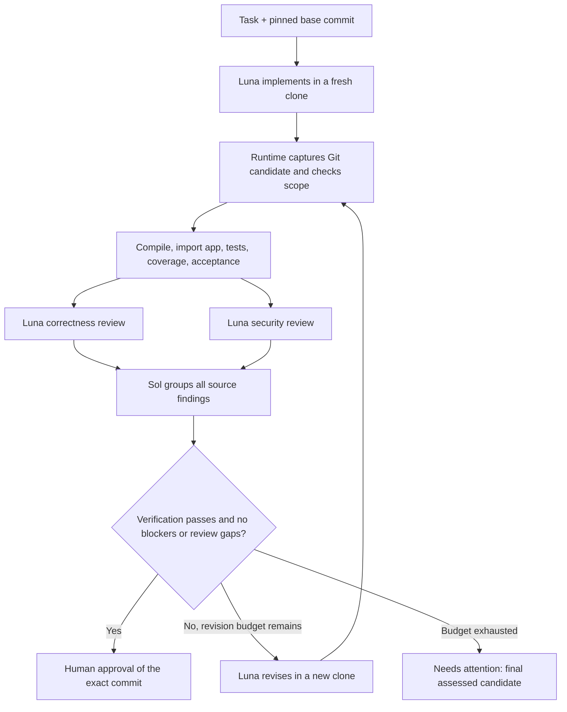

# HX — Evidence-gated coding harness

The [Sol meta loop](HX_META_LOOP.md) analyzes public failures and automatically
adopts bounded single-Luna runtime settings only after executable gates pass.
It records rejected proposals, candidate recovery evidence and current limits.

HX runs a bounded workflow over Codex CLI to fix bugs and add small features to a
committed FastAPI application, including React targets with full-stack verification.
The default [single-Luna workflow](SINGLE_LUNA.md) uses one implementer with
automatic repository mapping, patch replay, independent checks and bounded repairs.
The older reviewed mode remains configurable. Python owns scheduling, budgets,
verification, resume and the final human gate.

This is a local, single-user first version. Approval records a decision about one
exact commit. It does **not** merge, push, deploy or modify the original repository.

See [architecture and implementation status](ARCHITECTURE.md) for the component
map, context and memory design, verification paths, benchmark results and unfinished work.

The [live terminal console](CONSOLE.md) shows Luna implementing/reviewing,
Sol consolidating/proposing policies, and harness verification from recorded events:

```powershell
.\.venv\Scripts\python.exe scripts\hx_console.py --state-dir .hx\live
```

The [latest harness improvements](IMPROVEMENTS.md) add timeout repair feedback
and explicit revision plans. The [fresh 24-trial comparison](FRESH_BENCHMARK_RESULTS.md)
is complete: one-shot Luna 7/8, archived HX 8/8, improved HX 8/8. One controller
repair recovered a failed React test; updated HX did not improve task success
over archived HX. The single raw failure has a specification ambiguity.

## Hard tasks and harness improvement

The [benchmark guide](../benchmarks/README.md) documents 12 original repair tasks,
one-shot/full-workflow comparisons, independent acceptance scoring, reserved
evaluation tasks and bounded Sol policy search. The [synchronization extension](../benchmarks/advanced/README.md)
adds four larger FastAPI/React feature tasks and repair feedback for hanging tests.
These are local synthetic benchmarks, not scores on SWE-bench or Terminal-Bench.

The [SWE-PolyBench subset adapter](../benchmarks/polybench/README.md) adds a pinned
35-task public coding experiment using Docker and independent upstream grading.
Its completed development comparison and subsequent HX-only runs are documented in
[the morning report](MORNING_REPORT.md). They did not demonstrate a general
harness advantage; the six final reserved attempts produced one official solve.

The [final results](BENCHMARK_RESULTS.md) cover 100 completed model trials and 60 passing harness tests. No reserved success gain was demonstrated. Raw repair results are in `.hx/experiments-v1/REPORT.md`. Each trial retains
its candidate, effective configuration, worker traces and independent score.
Run `python scripts/benchmark_progress.py .hx/experiments-v1` to inspect progress.
The [React sample](http://127.0.0.1:5173/) uses the local API on port 8000.

## Quick start (PowerShell)

The virtual environment and dependencies have already been prepared in this checkout.
From `D:\projects\Harness`:

```powershell
.\.venv\Scripts\python.exe -m hx doctor

# The five demonstration tasks were created under .hx/demo.
# Scripted fixture run: no model calls or API spending.
.\.venv\Scripts\python.exe -m hx run .hx\demo\tasks\missing-task.json --adapter fake

# Real Codex workflow, using your existing Codex login.
codex login
.\.venv\Scripts\python.exe -m hx run .hx\demo\tasks\missing-task.json

.\.venv\Scripts\python.exe -m hx list
.\.venv\Scripts\python.exe -m hx status RUN_ID --full
.\.venv\Scripts\python.exe -m hx events RUN_ID --follow
.\.venv\Scripts\python.exe -m hx resume RUN_ID
.\.venv\Scripts\python.exe -m hx cancel RUN_ID

# Replace COMMIT with the full candidate hash printed in the handoff.
.\.venv\Scripts\python.exe -m hx approve RUN_ID --commit COMMIT
.\.venv\Scripts\python.exe -m hx deny RUN_ID --commit COMMIT --reason "Needs additional changes"
```

Use the same `--adapter fake` flag when resuming or deciding a fake run. Configuration,
prompt or runtime changes invalidate reuse; create a new run in that case.
If a handoff is `needs_attention`, approval is refused. Submit a new task to continue.

For a fresh checkout:

```powershell
python -m venv .venv
.\.venv\Scripts\python.exe -m pip install -e '.[dev]'
.\.venv\Scripts\python.exe -m hx demo
```

## Workflow



The initial candidate and **every** revision are verified and independently reviewed.
At the cap HX stops on the last assessed candidate, without making an unreviewed final
edit. `reviewed=true` means both reports cover that commit; it does not mean they found
no issues. `verified=true` means the configured deterministic checks passed.

Correctness and security reviews run in parallel. A successful branch is sealed and
saved immediately. A failed sibling cannot erase it. Consolidation must account for
every source finding exactly once; source blockers and high/critical severity cannot
be downgraded by Sol.

## Bring your own app

Create a JSON task specification, for example:

```json
{
  "id": "missing-user",
  "repo": "D:/projects/my-app",
  "report": "GET /users/{id} returns 500 for a missing user. Return 404 and add a regression test.",
  "kind": "bug",
  "base_commit": "HEAD",
  "allowed_paths": ["backend/**", "tests/**"],
  "protected_paths": ["tests/test_existing.py"],
  "test_paths": ["tests"],
  "app_module": "backend.app:app"
}
```

`repo` may be absolute or relative to the task file. HX uses the named **committed**
snapshot, resolves HEAD at intake, and leaves working-copy changes behind. Dependencies
must already be installed in the same Python environment as HX. Arbitrary test shell
commands, dependency installation and network-dependent integration tests are not
supported. `test_paths` is an argument list passed to pytest, never a shell command.

Allowed paths govern candidate changes. Protect existing test files individually;
protecting `tests/**` would also prevent the worker from adding regression tests.
Symlinks and submodules are unsupported and rejected.

The built-in acceptance checks apply only to the demo app. For another app, HX reports
that no independent acceptance check is configured. Passing tests or changed-line
coverage alone does not establish that a feature meets its requirements.

## Models, configuration and permissions

`hx.toml` contains model IDs and bounded policies. Defaults:

| Role | Model | CLI sandbox |
| --- | --- | --- |
| Implementer and revision worker | `gpt-6-luna` | `workspace-write` |
| Correctness reviewer | `gpt-6-luna` | `read-only` |
| Security reviewer | `gpt-6-luna` | `read-only` |
| Consolidator | `gpt-6.1-sol` | `read-only`, empty repository |

Each worker is a fresh, ephemeral `codex exec` session. HX ignores user CLI config,
disables web search, requests no shell network access, uses `approval_policy=never`,
and never enables unrestricted access. Authentication uses your saved Codex login.
API keys and other application secrets are not copied into worker or verifier
environments. Account model access must be confirmed by a live run.

On Windows, HX explicitly selects the native `elevated` sandbox backend because
ignoring user configuration otherwise removes the backend selection. This is a
restricted execution backend, not unrestricted worker access. If it has not been
set up, complete Codex's normal Windows sandbox onboarding first. Worker invocations
use `--no-daemon` so a shared server cannot supply unrelated session settings.

Two reviewers sharing a model can share blind spots. Distinct roles and fresh context
provide independence of sessions, not proof of model diversity.

## State, evidence and recovery

All generated data is under `.hx/`, excluded from version control:

```text
.hx/
  state.sqlite3                 authoritative state, event order and artifact digests
  api-token.txt                 local API bearer token
  demo/app/                     original demo Git repository
  demo/tasks/*.json              five bounded tasks
  runs/RUN_ID/
    events.jsonl                export of the ordered SQLite event stream
    artifacts/*.json            sealed candidate / verification / review / handoff
    handoff.md                  readable result
    steps/STEP/attempt-N/
      workspace/                isolated Git clone
      effective_config.json
      prompt.txt, schema.json
      result.json, stdout.txt, stderr.txt
      candidate.patch           implementer attempts
      private_acceptance/       evaluator-only diagnostic output
```

SQLite is the authority; `events.jsonl` is a convenience export. Artifact content hashes
are stored separately in SQLite. Replay checks hashes, schemas, input/configuration
fingerprints, candidate commit/diff and workspace cleanliness. Altered evidence fails
closed. It cannot be made valid simply by changing a JSON verdict.

Every retry starts from its declared input commit in a **fresh** clone. Failed partial
edits stay in the failed attempt directory for diagnosis and do not leak into retries.
Completed reviews are reused only for the exact same candidate and inputs.

`resume` is an explicit new bounded retry batch. It retains cumulative wall time and
observed usage; at most three resumes are allowed by default. A startup error is never
automatically retried. Recovery begins the failed step again, never halfway through
a model session. Missing or modified candidate workspaces invalidate replay.

## Local API

```powershell
.\.venv\Scripts\python.exe -m hx serve
```

The service binds to `127.0.0.1:8787`. Interactive API docs are at
`http://127.0.0.1:8787/docs`. Read `.hx/api-token.txt` locally and send it as
`Authorization: Bearer TOKEN`. All run endpoints require authentication; `/health`
does not. There is no permissive CORS configuration.

The local dashboard is at `http://127.0.0.1:8787/`. Connect with the token, choose a
demo task or paste a task spec, and inspect stages, evidence, diffs and events. The
token remains in tab memory. Approval and denial use the displayed exact revision.
Use `hx serve --adapter fake` to explore the dashboard without model calls.

| Method / path | Action |
| --- | --- |
| `POST /runs` | Submit `{"task": { ...task specification... }}` |
| `GET /runs` | List runs |
| `GET /runs/{id}` | Inspect run and step state |
| `GET /runs/{id}/events?after=SEQ` | Ordered incremental events |
| `GET /runs/{id}/diff` | Actual candidate diff |
| `POST /runs/{id}/cancel` | Request cancellation |
| `POST /runs/{id}/resume` | Queue recovery |
| `POST /runs/{id}/approve` | Record exact-commit approval |
| `POST /runs/{id}/deny` | Record exact-commit denial with a reason |

Decision bodies are `{"candidate_commit": "FULL_HASH", "reason": "..."}`. The API
runs workflows in a background executor, not inside HTTP request handlers. A per-run
OS file lock prevents concurrent execution/decision across CLI and API processes.

## Verification and failure tests

```powershell
.\.venv\Scripts\python.exe -m pytest -q
.\.venv\Scripts\ruff.exe check src tests
.\.venv\Scripts\python.exe -m hx benchmark .hx\demo\tasks --adapter fake --repeats 1
```

The tests execute real FastAPI behavior and cover malformed output, fabricated claims,
scope violations, stale reviews, reviewer writes, missing consolidation sources,
startup failure, timeouts, cancellation, bounded logs, clean retries, durable parallel
results, artifact tampering, configuration changes, a broken revision and approval
freshness. Fake runs test the runtime, **not** AI quality. The benchmark command reports
the full workflow's observed outcomes; it does not claim superiority over a baseline.

## Practical limits and next stages

- This local adapter is for trusted projects. Git clones and post-run gates are not
  an OS security boundary. Protected path writes are detected after the worker;
  reviewer write restrictions additionally rely on Codex's sandbox.
- The local sandbox can permit reads outside the workspace. The demo acceptance
  checks are omitted from worker context and their diagnostics are sanitized, but
  are **not secret from a hostile local process**. Verifying candidate Python executes
  its code as your user. Use separate container/VM identities, restricted mounts,
  credential isolation and evaluator processes before hostile-code benchmarking.
- Windows subprocesses are attached to kill-on-close Job Objects; POSIX uses process
  groups. This contains ordinary worker child processes, not adversarial OS escape.
- Wall time, attempt count, revision count, resume count and log volume are bounded.
  Token usage is reported at model turn boundaries and may overshoot the configured
  threshold. There is no guaranteed dollar spending cap or mid-turn token cutoff.
- No model-loop/stall detector, pause/steer controls, automatic publishing, external
  telemetry account, generated Python optimizer or distributed runner is included.
- A process crash can leave a running record. After the OS releases its execution
  lock, explicit resume can recover sealed steps. There is no mid-worker resume.

Next: finish reserved benchmark evaluation, add automated browser verification,
broaden independently reviewed tasks and add quota-aware scheduling. Full-stack
test/build verification and declarative context-policy search are already implemented.
Keep gates and scoring outside the optimizer's authority.

## Documentation used

- [Codex non-interactive mode](https://learn.chatgpt.com/docs/non-interactive-mode)
- [Codex sandboxing](https://learn.chatgpt.com/docs/sandboxing)
- [FastAPI testing](https://fastapi.tiangolo.com/tutorial/testing/)
- [Windows Job Objects](https://learn.microsoft.com/en-us/windows/win32/procthread/job-objects)
- [Langfuse prompt management](https://langfuse.com/docs/prompt-management/overview)
# Paper-based outer loop

HX now also has a bounded Sol code-search cycle with archived public experience,
independent mechanism evaluation and automatic gated adoption. See
[the implementation and its evidence limits](META_HARNESS_PAPER.md).
